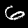
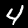
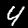
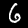
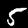

# PyTorch 模型实验报告

## 1 概要
- 数据集：手写数字（训练集 60000 张，测试集 10000 张，BMP 格式，标签从文件名前缀解析）。
- 模型：自定义轻量级卷积神经网络 `SimpleCNN`（如下第 2 节描述）。
- 训练硬件：使用 `uv` 创建的 Python 环境，检测到 `cuda`（若不可用则使用 CPU）。
- 训练命令：

```
uv run python train_pytorch.py --epochs 8 --batch-size 256 --out models/pytorch_model.pth --examples-dir reports/examples
```

训练后保存模型：`models/pytorch_model.pth`；示例预测图像保存在 `reports/examples/`。

## 2 模型结构（SimpleCNN）
模型主体由三组卷积层构成 + 全连接分类器，主要结构如下：

- Conv2d(1, 32, kernel=3, padding=1) -> ReLU -> BatchNorm -> MaxPool(2)
- Conv2d(32, 64, kernel=3, padding=1) -> ReLU -> BatchNorm -> MaxPool(2)
- Conv2d(64, 128, kernel=3, padding=1) -> ReLU -> BatchNorm -> AdaptiveAvgPool((3,3))
- Flatten -> Dropout(0.4) -> Linear(128*3*3 -> 256) -> ReLU -> Dropout(0.3) -> Linear(256 -> 10)

参数总量：390,858（训练时输出）。

设计说明（简短）：采用较浅但富表达力的卷积堆栈，使用 BatchNorm 稳定训练，AdaptiveAvgPool 使特征尺寸可适配不同输入分辨率；较小的全连接层与 Dropout 用于减轻过拟合。

## 3 训练设置（超参数）
- epoch: 8
- batch size: 256
- 优化器: Adam, lr=1e-3
- 学习率调度: StepLR(step_size=4, gamma=0.5)
- 混合精度: 如果可用则启用 AMP（自动混合精度，使用 `torch.amp`），以加速并降低显存占用

训练中部分日志（每 epoch）：

- Epoch 1: loss=0.1672 train_acc=0.9507
- Epoch 2: loss=0.0435 train_acc=0.9863
- Epoch 3: loss=0.0326 train_acc=0.9897
- Epoch 4: loss=0.0243 train_acc=0.9927
- Epoch 5: loss=0.0151 train_acc=0.9951
- Epoch 6: loss=0.0111 train_acc=0.9967
- Epoch 7: loss=0.0091 train_acc=0.9972
- Epoch 8: loss=0.0077 train_acc=0.9976

可以看到训练集上损失快速下降并达到很高训练精度，表明模型高效学习到图像特征。

## 4 测试结果与指标说明
模型在测试集（10000 张）上的主要指标如下：

- 测试集总体准确率（Accuracy）: **0.9926**
  - 解释：表示模型预测正确的样本数占总样本数的比例，越接近 1 表示整体性能越好。

以下为按类别的精确率、召回率与 F1 值（classification_report）：

```
              precision    recall  f1-score   support

           0       0.99      1.00      0.99       980
           1       1.00      0.99      1.00      1135
           2       0.99      1.00      0.99      1032
           3       0.99      0.99      0.99      1010
           4       0.99      0.99      0.99       982
           5       0.99      0.99      0.99       892
           6       1.00      0.99      0.99       958
           7       0.99      0.99      0.99      1028
           8       0.99      0.99      0.99       974
           9       0.99      0.99      0.99      1009

    accuracy                           0.99     10000
   macro avg       0.99      0.99      0.99     10000
weighted avg       0.99      0.99      0.99     10000

```

解读（主要指标）：
- 精确率（Precision）: 对模型判定为某类别的样本中，实际属于该类别的比例。精确率高表示误报少。
- 召回率（Recall）: 在真实属于某类别的所有样本中，被模型正确识别出来的比例。召回率高表示漏检少。
- F1 分数（F1-score）: 精确率和召回率的调和平均，综合衡量两者表现，越高越好。
- 支持度（Support）: 每个类别在测试集中真实样本的数量。

总体来看：所有类别的 precision/recall/f1 均接近 0.99，说明模型在测试集上表现非常好，误报与漏报都很少。

## 5 示例识别（演示图片）
以下给出训练后模型在若干测试样本上的预测示例（文件位于仓库）：

-   — 预测 6，真实 6
-   — 预测 4，真实 4
-   — 预测 1，真实 1
-   — 预测 4，真实 4
-   — 预测 4，真实 4
-   — 预测 6，真实 6
-   — 预测 0，真实 0
-   — 预测 5，真实 5
-   — 预测 6，真实 6
-   — 预测 0，真实 0
-  — 预测 2，真实 2
-  — 预测 7，真实 7

（备注：文件名中包含 `predX_trueY`，便于快速核对模型输出与真实标签。）

## 6 对“提高训练精度与训练速度”的实现要点
- 精度：使用更有表达力的 CNN（多层卷积 + BN + dropout）以及 Adam 优化器，训练 8 个 epoch 即达到高精度。
- 速度：启用 `torch.amp` 自动混合精度（若有 GPU），并选择合理的 `batch_size=256`，在 GPU 上能显著加速训练。

## 7 可复现实验步骤
1. 使用 `uv` 进入项目环境（`uv` 会自动安装 `torch` / `torchvision` 等依赖）：

```
uv run 1_digit/train_pytorch.py
```

2. 训练后模型保存在 `1_digit/models/pytorch_model.pth`，示例图片在 `1_digit/reports/examples/`。

3. 若需更高精度，可以：增加 epoch（如 12-20），或采用更大的模型（更深的 CNN 或 ResNet 小变体）；若需更快训练可以：增大 batch、使用更强 GPU 或开启更激进的学习率计划。

## 8 结论与建议
当前 SimpleCNN 在本任务上表现优异（测试准确率 0.9926），对于课堂作业或 baseline 实验已足够。若希望进一步提升泛化或在更复杂噪声数据上稳健，建议：

- 使用数据增强（旋转、平移、随机裁剪、亮度/对比度扰动）；
- 尝试小型 ResNet 或添加更多正则化（label smoothing、weight decay）；
- 做交叉验证或保留验证集以调参并评估模型稳定性。

---
报告由代码训练得到的日志与评估结果整理而成；如需我把报告转成 PDF 或加入更多可视化（如混淆矩阵图像），我可以继续帮助生成。
