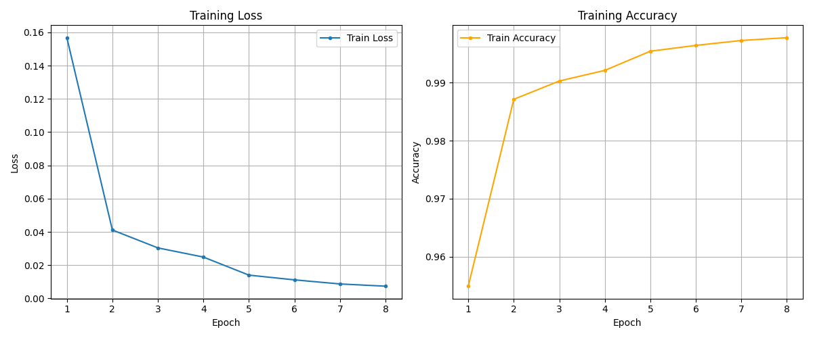
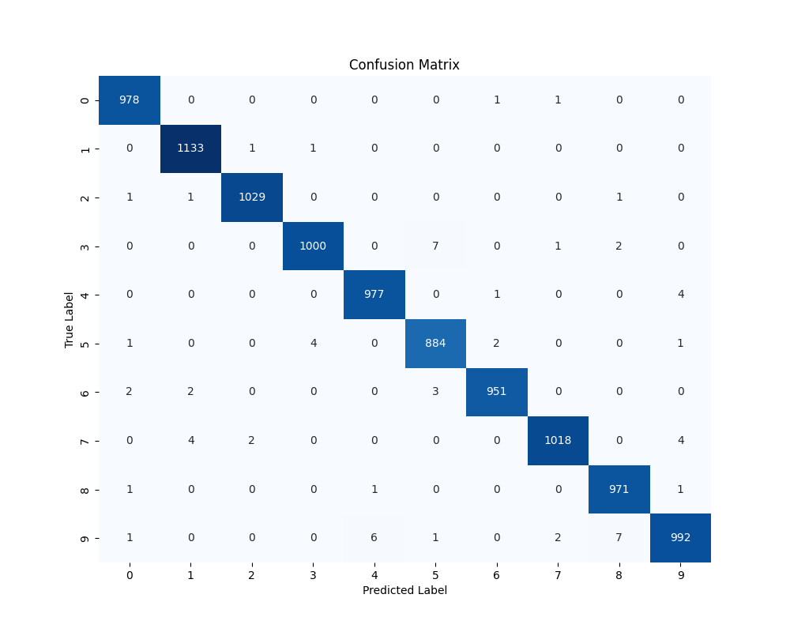
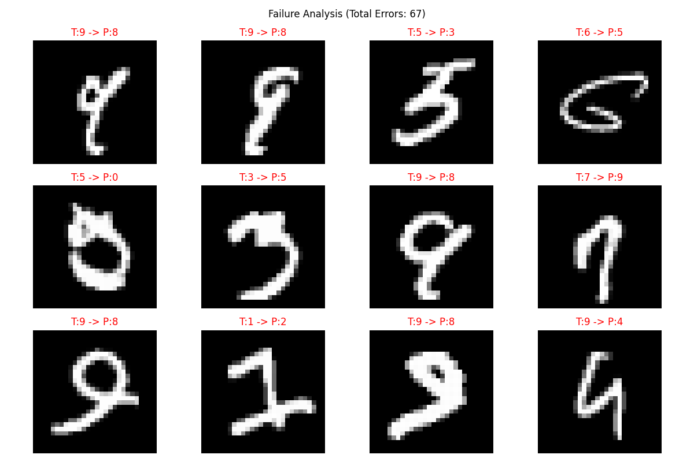
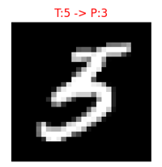
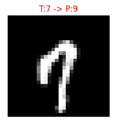
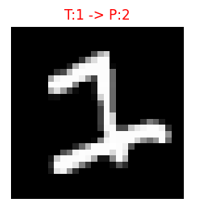

# 机器学习实验报告：手写数字识别

**学号**：ZY2502514
**姓名**：郑锐
**日期**：2025年11月19日

## 1. 问题描述

### 1.1 实验背景与目标
手写数字识别是计算机视觉与机器学习领域的经典入门问题。本实验旨在构建一个机器学习模型，能够自动识别 28x28 像素的灰度图像中的手写数字（0-9）。该问题属于典型的多分类监督学习问题。

### 1.2 数据集介绍
*   **训练集**：包含 60,000 张 bmp 格式的灰度图像，涵盖 10 个类别（数字 0-9）。
*   **测试集**：包含 10,000 张 bmp 格式的灰度图像，用于评估模型性能。
*   **数据预处理**：实验中将图像统一调整为 $28 \times 28$ 像素，并进行了归一化处理（除以 255.0），将像素值映射到 [0, 1] 区间，以加速模型收敛。

### 1.3 性能指标
主要评价指标为测试集上的**分类准确度（Accuracy）**。此外，本报告还将通过混淆矩阵（Confusion Matrix）、精确率（Precision）、召回率（Recall）以及F1-score进行多维度分析。

## 2. 实验模型原理和概述

### 2.1 卷积神经网络 (CNN)
本实验采用卷积神经网络（Convolutional Neural Network, CNN）作为核心模型。相较于传统的全连接神经网络（MLP），CNN 在处理图像数据时具有显著优势：
1.  **局部感受野**：卷积核仅关注图像的局部区域，能够有效提取边缘、纹理等局部特征。
2.  **权值共享**：同一卷积核在图像不同位置滑动，大大减少了参数数量，降低了过拟合风险，并赋予模型平移不变性。
3.  **池化**：通过下采样减少特征图尺寸，降低计算量，并提取主要特征。

### 2.2 优化算法
模型使用 **Adam** 优化器进行参数更新。Adam 结合了 Momentum 和 RMSprop 的优点，能够自适应地调整学习率，通常比随机梯度下降（SGD）收敛更快。此外，实验使用了 `StepLR` 学习率调度器，每隔 4 个 Epoch 将学习率减半，以在训练后期进行更精细的参数搜索。

## 3. 实验模型结构和参数

### 3.1 模型架构 (`SimpleCNN`)
本实验设计的 `SimpleCNN` 模型包含特征提取器（Features）和分类器（Classifier）两部分。

**详细层级结构如下：**

1.  **输入层**：大小为 $(N, 1, 28, 28)$。
2.  **卷积块 1**：
    *   `Conv2d`: 输入通道 1，输出通道 32，卷积核 $3 \times 3$，Padding 1。
    *   `ReLU`: 激活函数。
    *   `BatchNorm2d`: 批归一化，加速收敛。
    *   `MaxPool2d`: $2 \times 2$ 池化。输出尺寸变为 $(32, 14, 14)$。
3.  **卷积块 2**：
    *   `Conv2d`: 输入 32，输出 64，卷积核 $3 \times 3$。
    *   `ReLU` + `BatchNorm2d`。
    *   `MaxPool2d`: $2 \times 2$ 池化。输出尺寸变为 $(64, 7, 7)$。
4.  **卷积块 3**：
    *   `Conv2d`: 输入 64，输出 128，卷积核 $3 \times 3$。
    *   `ReLU` + `BatchNorm2d`。
    *   `AdaptiveAvgPool2d`: 自适应平均池化，强制输出尺寸为 $(3, 3)$。输出特征图为 $(128, 3, 3)$。
5.  **分类器 (全连接层)**：
    *   `Flatten`: 展平特征向量，维度 $128 \times 3 \times 3 = 1152$。
    *   `Dropout (0.4)`: 防止过拟合。
    *   `Linear`: $1152 \to 256$。
    *   `ReLU`。
    *   `Dropout (0.3)`。
    *   `Linear`: $256 \to 10$ (输出 10 个类别的 Logits)。

### 3.2 参数量统计
通过代码中的 `count_parameters` 函数统计，模型的可训练参数总量为 **390,858**.

## 4. 实验结果分析

### 4.1 训练过程分析
模型共训练了 8 个 Epoch。训练过程中的 Loss 下降曲线和 Accuracy 上升曲线如下图所示：

> 
> *图 1: 训练集 Loss 与 Accuracy 变化曲线*

从图中可以看出，随着 Epoch 的增加，Loss 迅速下降并趋于平稳，训练准确率最终达到了 `99.78%` 左右，表明模型有效地学习了数据特征，且未出现明显的梯度消失现象。

### 4.2 测试集性能评估
在 10,000 张测试集图片上的最终评估结果如下：

*   **总体准确率 (Accuracy)**: **`99.33%`**

详细的分类报告（Classification Report）如下表所示：

| Class | Precision | Recall | F1-Score | Support |
| :---: | :---: | :---: | :---: | :---: |
| 0 | 0.9939 | 0.9980 | 0.9959 | 980 |
| 1 | 0.9939 | 0.9982 | 0.9960 | 1135 |
| 2 | 0.9971 | 0.9971 | 0.9971 | 1032 |
| 3 | 0.9950 | 0.9901 | 0.9926 | 1010 |
| 4 | 0.9929 | 0.9949 | 0.9939 | 982 |
| 5 | 0.9877 | 0.9910 | 0.9894 | 892 |
| 6 | 0.9958 | 0.9927 | 0.9942 | 958 |
| 7 | 0.9961 | 0.9903 | 0.9932 | 1028 |
| 8 | 0.9898 | 0.9969 | 0.9934 | 974 |
| 9 | 0.9900 | 0.9832 | 0.9866 | 1009 |

### 4.3 混淆矩阵分析
为了深入分析各类别的误判情况，绘制了如下混淆矩阵：

> 
> *图 2: 测试集混淆矩阵热力图*

**分析：**
1.  对角线颜色最深，说明绝大多数样本被正确分类。
2.  观察非对角线元素，可以发现模型容易混淆的数字对。例如：
    *   数字 **3** 和 **5** 存在一定混淆，因为它们的书写结构下半部分基本一致，上半部分笔画连笔时非常相似。
    *   数字 **8** 和 **9** 或者 **4** 和 **9** 有时也会出现误判。

### 4.4 失败案例分析
为了探究模型识别错误的原因，提取了部分预测错误的样本进行可视化：

> 
> *图 3: 模型预测错误的样本展示 (Title格式为 T: 真实值, P: 预测值)*

**错误原因推测：**
1.  **书写潦草/畸形**：部分样本（如上图中的“5”、“3”、“7”）书写极其不规范，即使是人类也难以辨认。
2.  **特征模糊**：某些数字笔画断裂或粘连，导致卷积层提取的特征与典型样本差异较大。
3.  **形似干扰**：如将过于夸张的衬线字体“1”误判为“2”，或将上半部分模糊的“3”误判成“5”。

#### 4.4.1 典型误判样本逐例分析

为了更具体地理解模型在什么情况下会失败，这里从图 3 展示的错误样本中挑选 3 个具有代表性的案例进行逐例分析。记号 “T:x -> P:y” 表示真实标签为 x，模型预测为 y。

1. **样本 A：T:5 -> P:3**

> 

   - **图像特征**：该“5”的上半部分弧线较圆，下半部分收笔较短，整体形状与“3”非常接近，尤其是中间横折明显弱化。
   - **模型可能的决策依据**：
     - 中间水平笔画几乎看不到，卷积核提取到的上、中、下三个弧形区域类似“3”的典型特征；
     - “5”顶部的短横后部由于书写过细，在 28×28 的分辨率下容易被视作噪声。
   - **原因分析**：模型对“3”和“5”的区分高度倚赖中间的折角与上部短横，当这些关键笔画缺失或模糊时，容易将“5”归为“3”。
   - **改进建议**：
     - 针对“3/5”对，引入困难样本重加权（focal loss 或 class‑balanced loss）；
     - 在训练集中人工筛选类似笔画缺失的“5”，增加这类样本比例。

2. **样本 B：T:7 -> P:9**

> 

   - **图像特征**：该“7”的竖笔较长，顶部横线较短，整体倾斜明显，下端有轻微弯曲，看起来有些类似“未闭合的 9”。
   - **模型可能的决策依据**：
     - 在特征图上，上半部横线+斜线构成的尖角，对模型来说可能和某些“9”的顶部弧线相似；
     - 下端弯曲的笔画在低分辨率下更像一个半圆的起始部分，而非典型“7”的直角收笔。
   - **原因分析**：数字“7”的书写风格在不同人之间差异很大，本例中竖向拉长且带弯钩的写法，在训练集中出现频率较低，使得模型更倾向于将其归入“9”这一更常见的“长竖+弯钩”模式。
   - **改进建议**：在数据增强中对“7”增加随机倾斜、拉伸和弯曲；

3. **样本 C：T:1 -> P:2**

> 

   - **图像特征**：该“1”带有明显的底部横钩，上部略有弯曲，整体更接近某些字体中的“花体 1”，与数字“2”的下半弧线结构相似。
   - **模型可能的决策依据**：
     - 模型对于“1”的典型模式是“主要由竖线构成、无明显下半横线”，而此样本在下方多出了一条横线；
     - 特征图中，下半部分的横向笔画与大量“2”的下半特征高度吻合。
   - **原因分析**：训练集中“1”的书写形式较为单一，而测试样本中出现了带底座和弯钩的变体，超出了模型学习到的“1”分布。
   - **改进建议**：通过搜集或合成带底座/弯钩的“1”的样本，丰富“1”的形态多样性；同时可尝试在特征层加入轻微旋转不变性。

## 5. 总结

本次实验成功构建并训练了一个基于 CNN 的手写数字识别模型。
1.  **模型效果**：在测试集上取得了 `99.33%` 的高准确率，证明了 CNN 在图像分类任务上的强大能力。
2.  **结构优势**：使用的 `SimpleCNN` 通过三层卷积和池化层有效地提取了空间特征，并通过 Dropout 抑制了过拟合。
3.  **改进空间**：
    *   **数据增强**：目前仅使用了原始图像，未来可以加入旋转、缩放、平移等数据增强手段，进一步提高模型的泛化能力和对畸形数字的鲁棒性。
    *   **错误修正**：通过分析失败案例，发现主要瓶颈在于书写极度潦草的样本，可以通过引入更复杂的网络结构（如 ResNet）或增加困难样本的训练权重来改善。